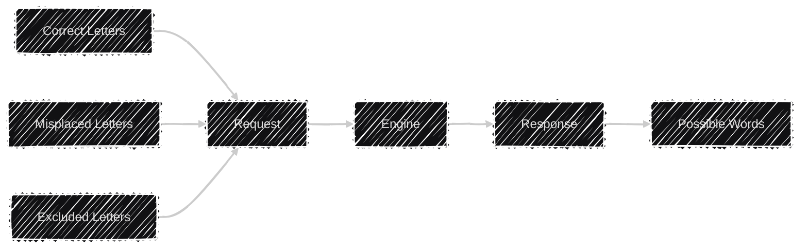

# Wizdle


[](https://github.com/lyndychivs/Wizdle/actions/workflows/build_test.yaml)
[](https://github.com/lyndychivs/Wizdle/actions/workflows/performance_tests.yaml)
[](https://github.com/lyndychivs/Wizdle/actions/workflows/solve_wordle.yaml)
[](https://dashboard.stryker-mutator.io/reports/github.com/lyndychivs/Wizdle/main)
[](https://www.nuget.org/packages/Wizdle/)
[](https://deepwiki.com/lyndychivs/Wizdle)

## 🔭 High Level

A library for solving Wordle. The [Wizdle core library](https://github.com/lyndychivs/Wizdle/tree/main/Wizdle) translates a request into a list of possible words.

**Simple Flow:**


```mermaid
---
config:
  theme: redux-dark
  look: handDrawn
  layout: fixed
---
flowchart LR
    CORRECT["Correct Letters"] --> REQUEST["Request"]
    MISPLACED["Misplaced Letters"] --> REQUEST
    EXCLUDE["Excluded Letters"] --> REQUEST
    REQUEST --> ENGINE["Engine"]
    ENGINE --> RESPONSE["Response"]
    RESPONSE --> WORDS["Possible Words"]
```

## Prerequisites

| Prerequisite | Note |
| --- | --- |
| .NET10 SDK | .NET10 or greater required. Check current .NET version `dotnet --version`. Download .NET10 from [the official download page](https://dotnet.microsoft.com/en-us/download/dotnet/10.0). |
| Docker | Download Docker from [Docker Get Started](https://www.docker.com/get-started/). |
| PowerShell | PowerShell (pwsh) required. Check current version `pwsh --version`. Download PowerShell from [PowerShell Releases](https://github.com/PowerShell/PowerShell/releases). |
| Make | Required to run Makefile commands. Install via Chocolatey `choco install make` or Scoop `scoop install make`. |

## Projects

| Project | Description |
| --- | --- |
| [Wizdle](https://github.com/lyndychivs/Wizdle/tree/main/Wizdle) | Core library and NuGet package — usage and examples in the [Wizdle README](https://github.com/lyndychivs/Wizdle/tree/main/Wizdle#readme) |
| [Wizdle.Api](https://github.com/lyndychivs/Wizdle/tree/main/Wizdle.Api) | Deployable REST API |
| [Wizdle.Web](https://github.com/lyndychivs/Wizdle/tree/main/Wizdle.Web) | Blazor web app (.NET Aspire + Docker) |
| [Wizdle.Console](https://github.com/lyndychivs/Wizdle/tree/main/Wizdle.Console) | CLI |
| [Wizdle.Wpf](https://github.com/lyndychivs/Wizdle/tree/main/Wizdle.Wpf) | WPF desktop app (Windows) |
| [Wizdle.Discord](https://github.com/lyndychivs/Wizdle/tree/main/Wizdle.Discord) | Discord bot — [invite](https://discord.com/oauth2/authorize?client_id=1381710402458620066&permissions=2048&integration_type=0&scope=bot) |

## 🧪 Testing

| Type | Command |
| --- | --- |
| Unit & Integration | `make test` |
| Functional | `make test-functional` |
| All | `make test-all` |
| Performance | `make perf` |
| Mutation | `make mutate` |

## ⚙️ Make

Run `make help` to see all available commands.

## Quick Start

```bash
make build       # build solution
make test        # run tests
make token       # generate API key token
make build-all   # build all Docker images
make compose     # start all services
make logs        # view logs
make stop        # stop services
```

## TL;DR for the TL;DR

> Lyndon, did you just spend all this time working on a tool to cheat wordle... rather than actually just solving the word?!
