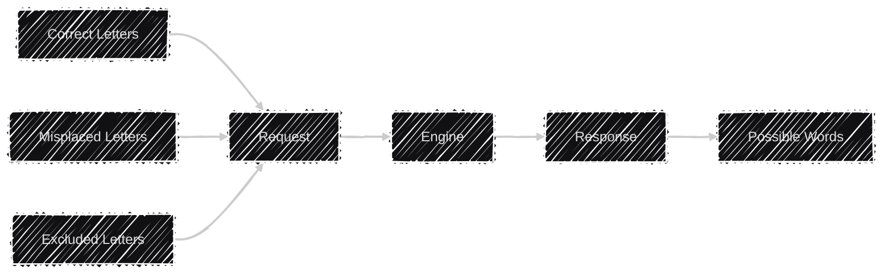

<p align="center"></p>

[](https://github.com/lyndychivs/Wizdle/actions/workflows/build-test.yaml)
[](https://github.com/lyndychivs/Wizdle/actions/workflows/solve-wordle.yaml)
[](https://dashboard.stryker-mutator.io/reports/github.com/lyndychivs/Wizdle/main)
[](https://www.nuget.org/packages/Wizdle/)

# 🔭 High Level

A library for solving Wordle.

**Simple Flow:**



## Prerequisites

| Prerequisite | Note                                                                                                                                                                |
| ------------ | ------------------------------------------------------------------------------------------------------------------------------------------------------------------- |
| .NET10 SDK   | .NET10 or greater required.<br/>Check current .NET version `dotnet --version`.<br/>Download .NET10 [here](https://dotnet.microsoft.com/en-us/download/dotnet/10.0). |
| Docker       | Download Docker [here](https://www.docker.com/get-started/).                                                                                                        |

# 🧙 Wizdle

The Wizdle core library found [here](https://github.com/lyndychivs/Wizdle/tree/main/Wizdle), is responsbile for translating the request into a list of possible Words.

## Example

```csharp
var wizdleEngine = new WizdleEngine(logger);

var request = new WizdleRequest
{
    CorrectLetters = "....t"
    MisplacedLetters = "..rs.",
    ExcludeLetters = "haebu",
};

WizdleResponse response = wizdleEngine.ProcessWizdleRequest(request);
// response.Words: ["skirt", "snort", "sport"]
```

## Package

Available on:

- [NuGet](https://www.nuget.org/packages/Wizdle/)
- [GitHub](https://github.com/lyndychivs/Wizdle/pkgs/nuget/Wizdle)

# 💻 Wizdle.Console

The Wizdle Console application allows us to access all the functionality of the Wizdle library via the CLI.

More information can be found [here](https://github.com/lyndychivs/Wizdle/tree/main/Wizdle.Console)

## Example

**Command:**

```
$ ./Wizdle.Console.exe solve --correct "....t" --misplaced "..rs." --exclude "haebu"
```

**Response:**

```
Processing WizdleRequest: CorrectLetters: "....t"   MisplacedLetters: "..rs." ExcludeLetters: "haebu"
Mapping WizdleRequest:    CorrectLetters: "....t"   MisplacedLetters: "..rs." ExcludeLetters: "haebu"
Mapped SolveParameters:   CorrectLetters: "????t"   MisplacedLetters: "??rs?" ExcludeLetters: "haebu"
Found 3          Word(s) matching the criteria.
Found 3 Word(s) matching the criteria.
skirt
snort
sport
```

# 🪟 Wizdle.Wpf
The Wizdle WPF application allows us to access all the functionality of the Wizdle library via a GUI on Windows.

More information (and installers) can be found [here](https://github.com/lyndychivs/Wizdle/tree/main/Wizdle.Wpf).


# 📨 Wizdle.Api

The Wizdle Api Service contains a deployable API instance of the Wizdle library.

More information can be found [here](https://github.com/lyndychivs/Wizdle/tree/main/Wizdle.Api)

## 🎯 `POST`

**Summary**: Processes a Wizdle request in an attempt to solve the possible words.

### Request

**Content-Type:** `application/json`

#### Body Parameters

| Name               | Type     |
| ------------------ | -------- |
| `correctLetters`   | `string` |
| `misplacedLetters` | `string` |
| `excludeLetters`   | `string` |

**Example:**

```json
{
    "correctLetters": "a__le",
    "misplacedLetters": "t",
    "excludeLetters": "xyz"
}
```

---

### Response

**Status Code:** `200 OK`

#### Body

| Name       | Type              |
| ---------- | ----------------- |
| `messages` | `array of string` |
| `words`    | `array of string` |

**Example:**

```json
{
    "messages": ["Found 2 Word(s) matching the criteria."],
    "words": ["apple", "angle"]
}
```

# 📲 Wizdle.Web

The Wizdle Web contains a deployable Blazor web app instance of the Wizdle library (hosted on the new dotnet Aspire platform & Docker).

More information can be found [here](https://github.com/lyndychivs/Wizdle/tree/main/Wizdle.Web)


# 🤖 Wizdle.Discord

A Discord bot hosting all the functionality of the Wizdle library, users can integrate the bot into their Discord servers.

Invite [link for Discord](https://discord.com/oauth2/authorize?client_id=1381710402458620066&permissions=2048&integration_type=0&scope=bot).

# 🧪 Testing

- Unit Testing
    - [Wizdle.Unit.Tests](https://github.com/lyndychivs/Wizdle/tree/main/Wizdle.Unit.Tests)
- Integration Testing
    - [Wizdle.Integration.Tests](https://github.com/lyndychivs/Wizdle/tree/main/Wizdle.Integration.Tests)
- Functional Testing
    - [Wizdle.Api.Functional.Tests](https://github.com/lyndychivs/Wizdle/tree/main/Wizdle.Api.Functional.Tests)
    - [Wizdle.Web.Functional.Tests](https://github.com/lyndychivs/Wizdle/tree/main/Wizdle.Web.Functional.Tests) (using Playwright)
- Performance Testing
    - [Wizdle.Performance.Tests](https://github.com/lyndychivs/Wizdle/tree/main/Wizdle.Performance.Tests) (using BenchmarkDotNet)
- Accessibility Testing
    - [Wizdle.Web.Functional.Tests](https://github.com/lyndychivs/Wizdle/tree/main/Wizdle.Web.Functional.Tests) (using axe-core)
- Mutation Testing
    - [Strkyer.NET](https://dashboard.stryker-mutator.io/reports/github.com/lyndychivs/Wizdle/main) with [my GitHub Action](https://github.com/lyndychivs/dotnet-stryker-action)

# ⚙️ Make

This project includes a Makefile to simplify common development tasks. Run `make help` to see all available commands.

## Available Commands

| Command                | Description                                                 |
| ---------------------- | ----------------------------------------------------------- |
| `make help`            | Show all available make commands                            |
| `make build`           | Build the entire solution in Release mode                   |
| `make test`            | Run unit and integration tests                              |
| `make build-api`       | Build the Wizdle.Api Docker image                           |
| `make build-web`       | Build the Wizdle.Web Docker image                           |
| `make build-discord`   | Build the Wizdle.Discord Docker image                       |
| `make build-all`       | Build all Docker images (api, web, discord)                 |
| `make compose`         | Start all services using docker-compose in detached mode    |
| `make stop`            | Stop all running Docker containers                          |
| `make stop-volumes`    | Stop containers and remove associated volumes               |
| `make logs`            | Show and follow logs from all Docker containers             |
| `make restart`         | Stop containers, rebuild all images, and restart services   |
| `make clean`           | Clean build artifacts and prune all Docker resources        |
| `make docker-prune`    | Prune unused Docker resources (images, containers, volumes) |
| `make trust-cert`      | Trust the .NET HTTPS development certificate                |
| `make token`           | Generate a random 32-character token for API keys           |
| `make mutation`        | Run Stryker mutation testing                                |
| `make aspire`          | Update Aspire tooling to latest version                     |
| `make playwright`      | Install Playwright browsers                                 |
| `make solve`           | Attempts to solve Wordle using Wizdle                       |
| `make test-functional` | Run all functional tests                                    |
| `make test-all`        | Run all tests (unit, integration, functional, solve)        |

## Quick Start

1. Build the solution:

    ```bash
    make build
    ```

2. Run tests:

    ```bash
    make test
    ```

3. Generate tokens for your `.env` file:

    ```bash
    make token
    ```

4. Build all Docker images:

    ```bash
    make build-all
    ```

5. Start all services:

    ```bash
    make compose
    ```

6. View logs:

    ```bash
    make logs
    ```

7. Stop services:
    ```bash
    make stop
    ```

# TL;DR for the TL;DR

> Lyndon, did you just spend all this time working on a tool to cheat wordle... rather than actually just solving the word?!
