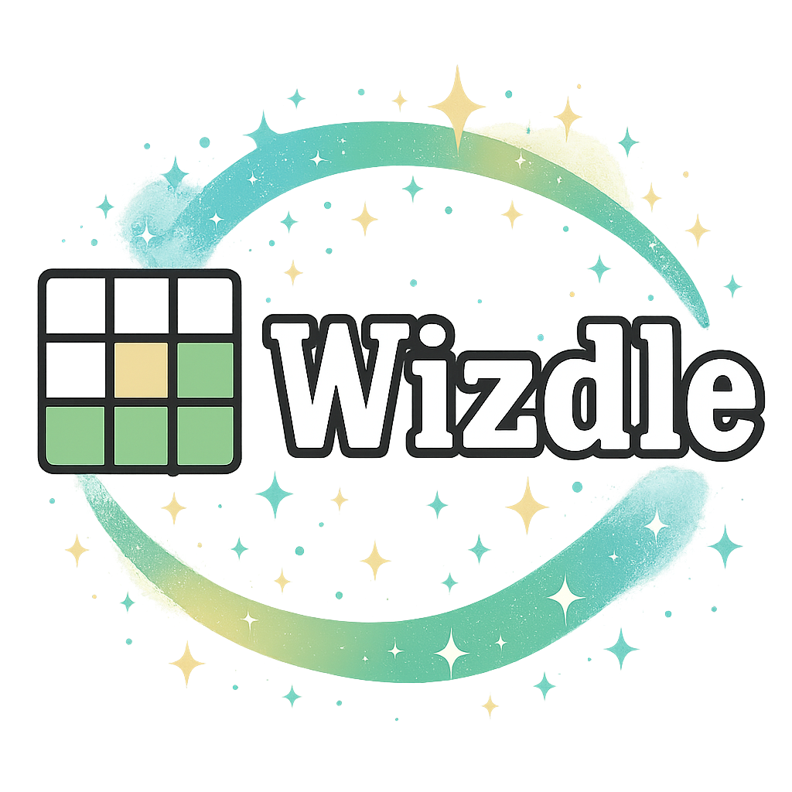
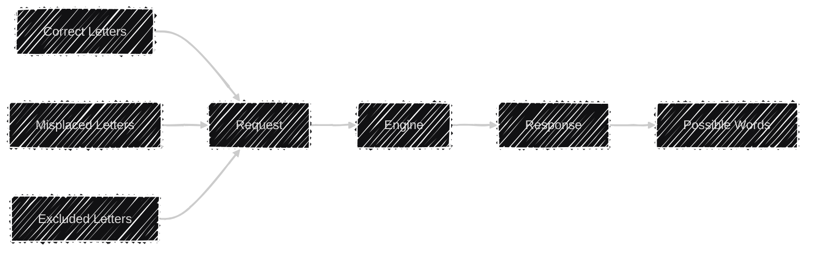

# 🔭 High Level
A library for solving Wordle.

**Simple Flow:**

## Prerequisites
| Prerequisite        | Note |
| :---                | :--- |
| .NET8 SDK           | .NET8 or greater required. Check current .NET version `dotnet --version`. Download .NET8 [here](https://dotnet.microsoft.com/en-us/download/dotnet/8.0). |
