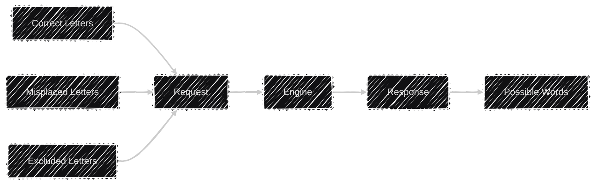

<p align="center"></p>

[](https://dashboard.stryker-mutator.io/reports/github.com/lyndychivs/Wizdle/master)
[](https://www.nuget.org/packages/Wizdle/)

# 🔭 High Level
A library for solving Wordle.

**Simple Flow:**



## Prerequisites

| Prerequisite | Note |
| ---          | ---  |
| .NET9 SDK    | .NET9 or greater required.<br/>Check current .NET version `dotnet --version`.<br/>Download .NET9 [here](https://dotnet.microsoft.com/en-us/download/dotnet/9.0). |

# 🧙 Wizdle
The Wizdle core library found [here](https://github.com/lyndychivs/Wizdle/tree/master/Wizdle), is responsbile for translating the request into a list of possible Words.

## Example
```csharp
var wizdleEngine = new WizdleEngine(logger);

var request = new WizdleRequest
{
    CorrectLetters = "....t"
    MisplacedLetters = "..rs.",
    ExcludeLetters = "haebu",
};

WizdleResponse response = wizdleEngine.ProcessWizdleRequest(request);
// response.Words: ["skirt", "snort", "sport"]
```

## Package
Available on:
- [NuGet](https://www.nuget.org/packages/Wizdle/)
- [GitHub](https://github.com/lyndychivs/Wizdle/pkgs/nuget/Wizdle)

# 💻 Wizdle.Console
The Wizdle Console application allows us to access all the functionality of the Wizdle library via the CLI.

More information can be found [here](https://github.com/lyndychivs/Wizdle/tree/master/Wizdle.Console)

## Example
**Command:**
```
$ ./Wizdle.Console.exe solve --correct "....t" --misplaced "..rs." --exclude "haebu"
```
**Response:**
```
Processing WizdleRequest: CorrectLetters: "....t"   MisplacedLetters: "..rs." ExcludeLetters: "haebu"
Mapping WizdleRequest:    CorrectLetters: "....t"   MisplacedLetters: "..rs." ExcludeLetters: "haebu"
Mapped SolveParameters:   CorrectLetters: "????t"   MisplacedLetters: "??rs?" ExcludeLetters: "haebu"
Found 3          Word(s) matching the criteria.
Found 3 Word(s) matching the criteria.
skirt
snort
sport
```

# 🪟 Wizdle.Windows
The Wizdle Windows application allows us to access all the functionality of the Wizdle library via a GUI on Windows.

More information (and installers) can be found [here](https://github.com/lyndychivs/Wizdle/tree/master/Wizdle.Windows).


# 📨 Wizdle.ApiService
The Wizdle Api Service contains a deployable API instance of the Wizdle library.

More information can be found [here](https://github.com/lyndychivs/Wizdle/tree/master/Wizdle.ApiService)

## 🎯 `POST`

**Summary**: Processes a Wizdle request in an attempt to solve the possible words.

### Request

**Content-Type:** `application/json`

#### Body Parameters

| Name | Type |
|------|------|
| `correctLetters` | `string` |
| `misplacedLetters` | `string` |
| `excludeLetters` | `string` |


**Example:**

```json
{
  "correctLetters": "a__le",
  "misplacedLetters": "t",
  "excludeLetters": "xyz"
}
```

---

### Response

**Status Code:** `200 OK`

#### Body

| Name | Type |
|------|------|
| `messages` | `array of string` |
| `words` | `array of string` |


**Example:**

```json
{
  "messages": ["Found 2 Word(s) matching the criteria."],
  "words": ["apple", "angle"]
}
```

# 📲 Wizdle.Web
The Wizdle Web contains a deployable Blazor web app instance of the Wizdle library (hosted on the new dotnet Aspire platform).

More information can be found [here](https://github.com/lyndychivs/Wizdle/tree/master/Wizdle.Web)


# 🤖 Wizdle.Discord
A Discord bot hosting all the functionality of the Wizdle library, users can integrate the bot into their Discord servers.

Invite [link for Discord](https://discord.com/oauth2/authorize?client_id=1381710402458620066&permissions=2048&integration_type=0&scope=bot).

# 🧪 Testing
- Unit Testing
  - [Wizdle.Tests](https://github.com/lyndychivs/Wizdle/tree/master/Wizdle.Tests)
- Integration Testing
  - [Wizdle.IntegrationTests](https://github.com/lyndychivs/Wizdle/tree/master/Wizdle.IntegrationTests)
- Functional Testing
  - [Wizdle.ApiService.Tests](https://github.com/lyndychivs/Wizdle/tree/master/Wizdle.ApiService.Tests)
  - [Wizdle.Web.Tests](https://github.com/lyndychivs/Wizdle/tree/master/Wizdle.Web.Tests) (using Playwright)
- Performance Testing
  - [Wizdle.PerformanceTests](https://github.com/lyndychivs/Wizdle/tree/master/Wizdle.PerformanceTests) (using BenchmarkDotNet)
- Mutation Testing
  - [Strkyer.NET](https://dashboard.stryker-mutator.io/reports/github.com/lyndychivs/Wizdle/master) with [my GitHub Action](https://github.com/lyndychivs/dotnet-stryker-action)
 
# TL;DR for the TL;DR
> Lyndon, did you just spend all this time working on a tool to cheat wordle... rather than actually just solving the word?!

