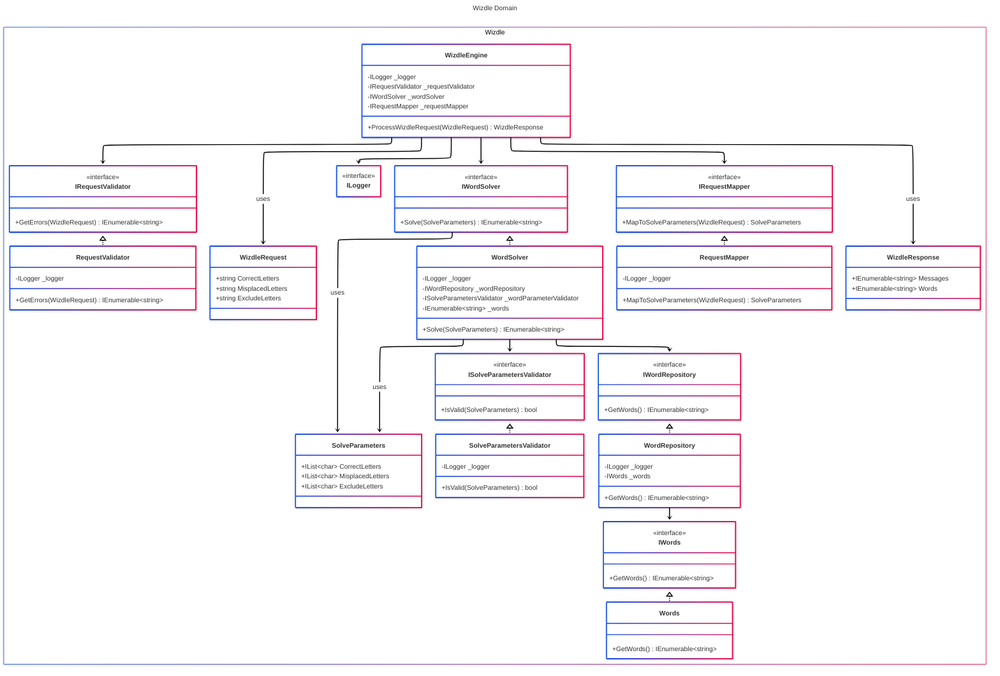

# Wizdle.Domain

Class Domain model created using [mermaid](https://www.mermaidchart.com/).

```mermaid
---
config:
  class:
    hideEmptyMembersBox: true
  look: neo
  theme: neo
  layout: elk
title: Wizdle Domain
---
classDiagram
direction TB
    namespace Wizdle {
        class IWords {
            +GetWords() IEnumerable~string~
        }

        class Words {
            +GetWords() IEnumerable~string~
        }

        class IRequestMapper {
            +MapToSolveParameters(WizdleRequest) SolveParameters
        }

        class RequestMapper {
            -ILogger _logger
            +MapToSolveParameters(WizdleRequest) SolveParameters
        }

        class IWordRepository {
            +GetWords() IEnumerable~string~
        }

        class WordRepository {
            -ILogger _logger
            -IWords _words
            +GetWords() IEnumerable~string~
        }

        class IWordSolver {
            +Solve(SolveParameters) IEnumerable~string~
        }

        class WordSolver {
            -ILogger _logger
            -IWordRepository _wordRepository
            -ISolveParametersValidator _wordParameterValidator
            -IEnumerable~string~ _words
            +Solve(SolveParameters) IEnumerable~string~
        }

        class SolveParameters {
            +IList~char~ CorrectLetters
            +IList~char~ MisplacedLetters
            +IList~char~ ExcludeLetters
        }

        class ISolveParametersValidator {
            +IsValid(SolveParameters) bool
        }

        class SolveParametersValidator {
            -ILogger _logger
            +IsValid(SolveParameters) bool
        }

        class IRequestValidator {
            +GetErrors(WizdleRequest) IEnumerable~string~
        }

        class RequestValidator {
            -ILogger _logger
            +GetErrors(WizdleRequest) IEnumerable~string~
        }

        class WizdleEngine {
            -ILogger _logger
            -IRequestValidator _requestValidator
            -IWordSolver _wordSolver
            -IRequestMapper _requestMapper
            +ProcessWizdleRequest(WizdleRequest) WizdleResponse
        }

        class WizdleResponse {
            +IEnumerable~string~ Messages
            +IEnumerable~string~ Words
        }

        class WizdleRequest {
            +string CorrectLetters
            +string MisplacedLetters
            +string ExcludeLetters
        }

        class ILogger {
        }

    }

    <<interface>> IWords
    <<interface>> IRequestMapper
    <<interface>> IWordRepository
    <<interface>> IWordSolver
    <<interface>> ISolveParametersValidator
    <<interface>> IRequestValidator
    <<interface>> ILogger

    IWords <|.. Words
    IRequestMapper <|.. RequestMapper
    IWordRepository <|.. WordRepository
    WordRepository --> IWords
    IWordSolver <|.. WordSolver
    IWordSolver --> SolveParameters : uses
    WordSolver --> SolveParameters : uses
    WordSolver --> IWordRepository
    WordSolver --> ISolveParametersValidator
    ISolveParametersValidator <|.. SolveParametersValidator
    IRequestValidator <|.. RequestValidator
    WizdleEngine --> IRequestValidator
    WizdleEngine --> IWordSolver
    WizdleEngine --> IRequestMapper
    WizdleEngine --> WizdleRequest : uses
    WizdleEngine --> WizdleResponse : uses
    WizdleEngine --> ILogger

```
